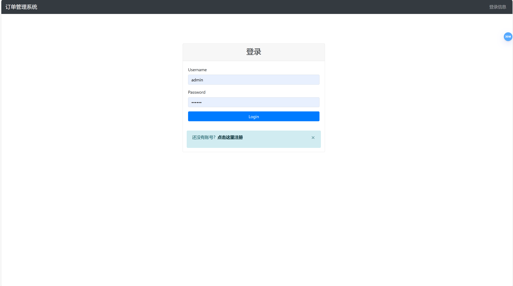
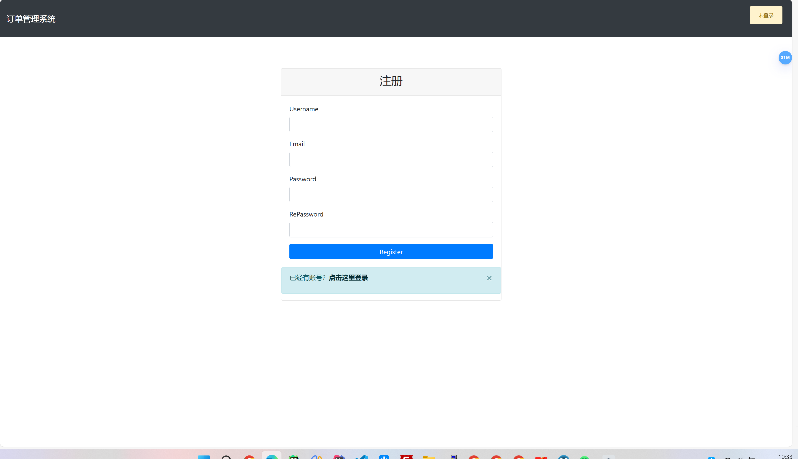
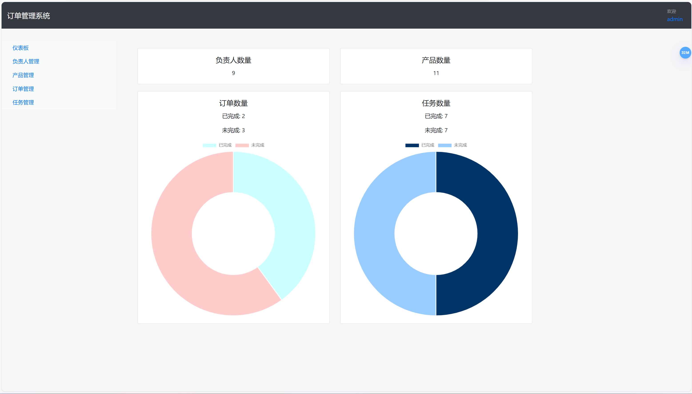
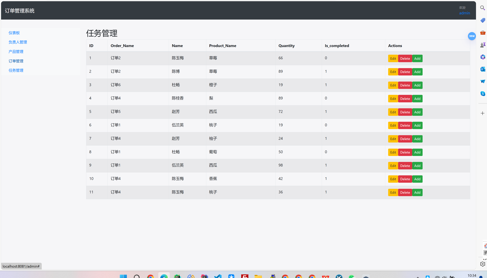

# 订单管理系统
> javaEE练习项目 订单管理系统,具有可视化图表，负责人管理，产品管理，订单管理，任务管理简单功能

>  环境: mysql5.7 jdk1.8 tomact8.5.931

## 功能简单展示

## 运行注意
数据库表创建，运行前提前运行com.uitls.Creta_table_utils.java程序。

****
``该项目中仍存在许多不完善之处和bug欢迎指正！``

